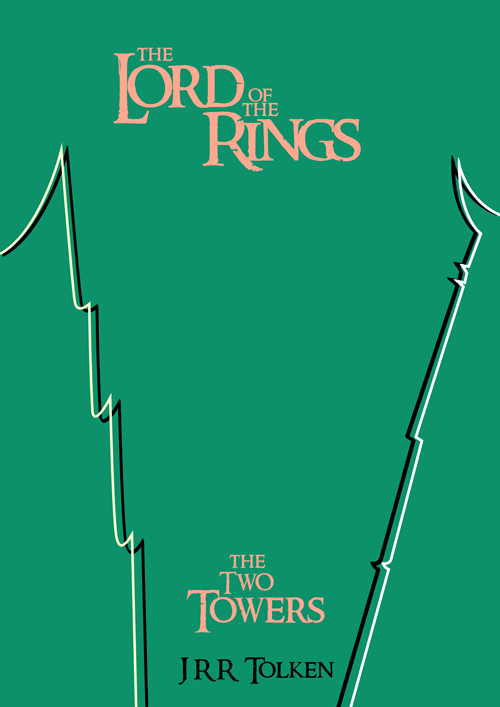
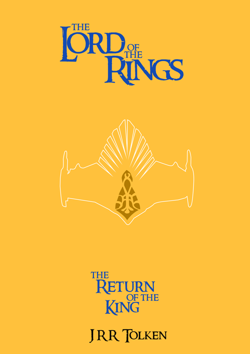

Book Covers
===========

This was an Illustrative project that I done for my course work. We were told to pick a genre of books that we liked, then find books from this genre and illustrate a new cover for them. I think this was around the time the Hobbit came out so I was back to being a fan boy and I knew I just needed to have a go at illustrating new covers for the Lord of The Rings trilogy.

The Lord of The Rings
---------------------

So this is the final version of The Fellowship Of The Ring of the covers that I came up with and I fell they are well suited for the story. As you can see I went with a basic layout but its still effective at getting across the information about the books. I want with a cream background as I wanted to go with something that just looked nice and for me cream gives of a good vibe. I then made a contrast with the Red text, the reason for this was so that the title etc will stand out more. Then for the circle I went with just a goldish line as I liked how simple it is, it doesn't stand out to much but still stands out. Over all I am very happy with the out come of this cover and wouldn't change a thing.

Then with this being the final version of The Two Towers, I like this cover the best. I wanted to keep the minimalist line making up the illustrated images. So for this I went with a line creating the towers and for me I think this look nice. For this I decided to go out there with the colours and went with a turquoise greeny colour. Then the text in a pinkish colour which I think goes well with the background colour. For the lines I changed them a bit by making the main one white and I then added a smaller black one so this sort of is like a shadow. I think this work very well and is very eye catching.

Now on to the last cover The Return Of The King and with this one it is drawing at second place with the first cover. As you can see I went with a weird colour scheme again and I like as everything stands out in the way its meant to. The background is an orangey colour which I like but the more I look is becomes a bit over powering. But any ways the text is a dark blue colour that goes very well with the background of the book. With that the illustration is the main thing that has changes and this one was the hardest to do. I shall say it here that I used the pen tool on both this one and the second cover for illustrations. This one took a while as it kept going funny but eventually it went my way and I got it done. I wasn't going to add in the centre part but as I was going for a minimalist look but I said screw it and done it any ways. I think this part helps this cover out by adding another colour to the mix and just something else you eye have to take in.

So this is the end of them, over all I fell that the book covers convay the story of the book. I could have made more of and effort with tying the colour scheme into the story as well. Though I do like them deing such uniqe colours as they will stand out from other books.